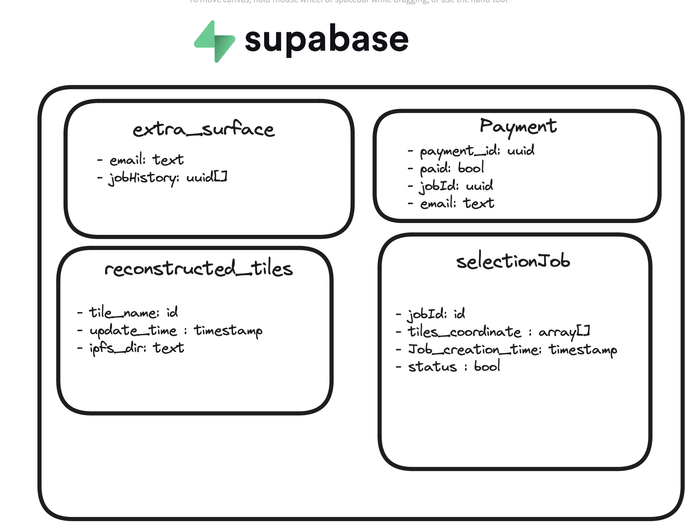

## Extra-surface
UI and SaaS platform that allows the user to schedule 3D reconstructions (by paying a nominal fee for supporitng the infrastructure costs) of LidarHD tiles to 3D meshes of bigger regions (in colorized / 3D format)

## Credits:
- [Distributed watertight surface reconstruction, Laurent Caraffa et.al](https://lcaraffa.github.io/edwsr/).  
- [code implementation of EDWSR](https://github.com/lcaraffa/sparkling-wasure.git).


For referencing the paper:

```
@inproceedings{caraffa:hal-03380593,
  TITLE = {Efficiently Distributed Watertight Surface Reconstruction},
  AUTHOR = {CARAFFA, Laurent and Marchand, Yanis and Br{\'e}dif, Mathieu and Vallet, Bruno},
  URL = {https://hal.archives-ouvertes.fr/hal-03380593},
  BOOKTITLE = {2021 International Conference on 3D Vision (3DV)},
  ADDRESS = {London, United Kingdom},
  YEAR = {2021},
  MONTH = Dec,
  PDF = {https://hal.archives-ouvertes.fr/hal-03380593/file/2021216131.pdf},
  HAL_ID = {hal-03380593},
  HAL_VERSION = {v1},
}
```
## Stack components: 

It consist of the following stack components to run the application:

</img>

- [Supabase](): For storing the user session database (their payment, current job) , current reconstruction of the tiles status etc. 

- [Stripe](): For the payment of the compute costs (fixed per tile in the [frontend]() code).

- [sparkling_washeur](): Consisting of the reconstruction pipeline with dockerised version.

- [Resend](): Service to send the email notifications describing user the different state and the retrieval of the results from the backend once its generated.

- [AWS S3](): Storage service in order to store: 
  - The laz files recovered from the diffusion lidarhd text url file (uploaded by the user).
  - The output results after the reconstruction.


- [AWS Lambda](): For the compute of the reconstruction of the tiles.

- [AWS ECR](): For the container registry of the sparkling_washeur.

- [AWS SQS ](): For the queue of the reconstruction jobs.

- [AWS Cloudtrail](): For the logging of the events that are generated in the AWS infrastructure.


## Setup: 


**Prerequisites**:
- Node.js and npm installed.
- Docker and docker compose installed.
- AWS CLI installed.
- AWS credentials configured.


### 1. containerized deployment:
- **Define the environment variables**: in the .env file, you need to define the correct variables for the application to run.

-  **Run the docker compose**: 
   ```bash
   docker compose build
   docker compose up -d
   ```

### 1. For frontend (from source):

-  **Install Dependencies**: Navigate to the frontend directory and install the required dependencies using your preferred package manager. You can use npm, yarn, or pnpm:
   ```bash
   npm install
   # or
   yarn install
   # or
   pnpm install
   ```
- **Copy the .env.example file to .env and fill in the required variables**: in case you are deploying on local or remote server, you need to setup the .env.development file or .env.production file with the correct variables initialized. also check env.ts file for the variables that are used in the application.

- **Build the Application**: Run the following command to build the application for production (or either local watch mode):
  ```bash
  npm run build

  ```
- **Start the Development Server**: Run the following command to start the development server:
  ```bash
  npm run dev
  ```

### 2. For backend:

### Running Lambda Functions in Production

To run the lambda functions in production, follow these steps:

1. **Install AWS SAM CLI**: Ensure you have the AWS SAM CLI installed. You can follow the installation guide from the [official AWS documentation](https://docs.aws.amazon.com/serverless-application-model/latest/developerguide/install-sam-cli.html).

2. **Navigate to the Lambda Function Directory**: Change your directory to the `@sparkling_washeur_algo` folder where the lambda functions are located.
   ```bash
   cd backend/sparkling_washeur_serverless/lambda_services/[files_uploader/events/spark_job_emr]
   ```

3. **Build the Lambda Functions**: Use the AWS SAM CLI to build the lambda functions.
   ```bash
   sam build
   ```

4. **Package the Lambda Functions**: Package the lambda functions using the AWS SAM CLI. This step uploads the built artifacts to an S3 bucket.
   ```bash
   sam package --output-template-file packaged.yaml --s3-bucket ##<YOUR_S3_BUCKET_NAME 
   ```

5. **Deploy the Lambda Functions**: Deploy the lambda functions using the AWS SAM CLI.
   ```bash
   sam deploy  --guided --template-file packaged.yaml --stack-name YOUR_STACK_NAME --parameter-overrides  ## your parameters key=value , .....
   ```

6. **Verify the Deployment**: After deployment, verify that the lambda functions are correctly deployed and running in the AWS Management Console.


#### Note: 

- For the sparkling_washeur_emr, you need to setup the ECR repository of the sparkling_washeur that generated by pushing the build from sparkling_washeur_algo.


8. **For the sparkling_washeur_serverless**:

- setup the .env file with the AWS creds and the S3 bucket name.

- use docker-compose to build the repo 
```bash
docker-compose build sparkling_washeur
docker-compose up -d
```
